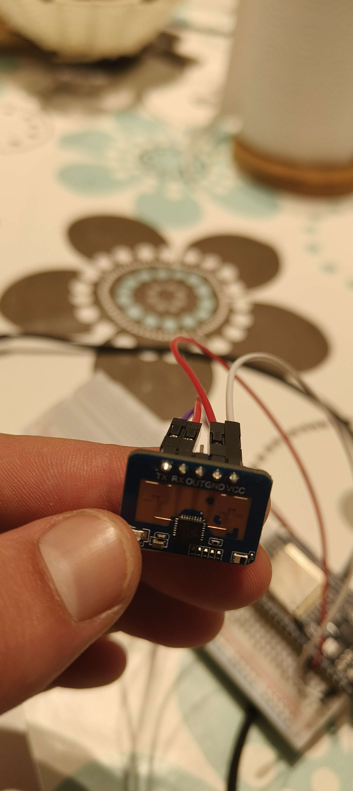
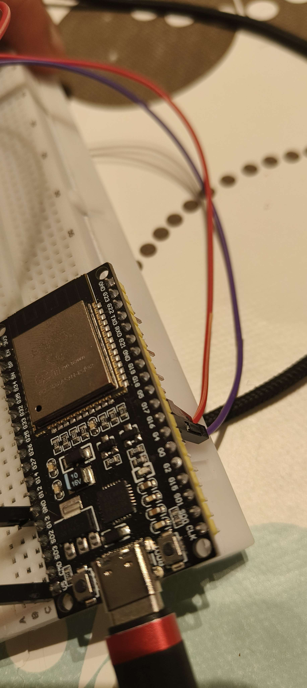
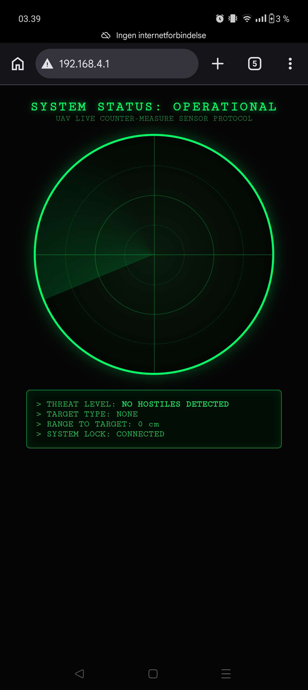
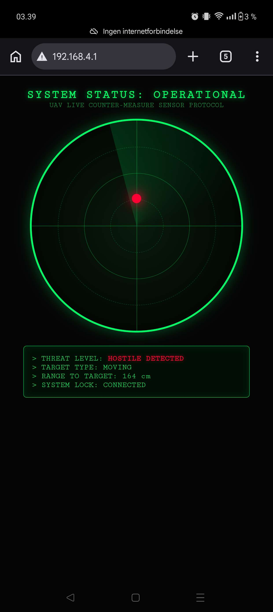
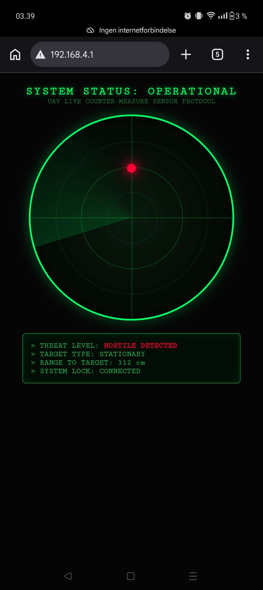

# 📡 ESP32 LD2410C Human Presence Radar Dashboard

My first solo IoT project built using an **ESP32** and the **Hi-Link LD2410C mmWave radar sensor**.

The ESP32 creates its own Wi-Fi Access Point, allowing any nearby phone, tablet, or computer to connect directly to the dashboard without requiring an internet connection.  
The dashboard displays live radar information using WebSockets for real-time updates.

This project demonstrates how low‑cost mmWave sensors can enable real‑time human detection for smart environments, robotics, and security systems.

### Hardware Overview

Below are the physical components used in this project.

  
  

These photos show the LD2410C mmWave radar sensor and the ESP32 DevKit wiring used for the dashboard setup.

---

## 🖼️ Preview

### No Target Detected

  

### Moving Target Detected

  

### Stationary Target Detected

  

---

## ⚙️ Features
- 📡 ESP32 Wi-Fi Access Point (192.168.4.1)
- 🌐 Standalone operation (no internet required)
- ⚡ Real-time WebSocket communication
- 👤 Human presence detection
- 🚶 Moving target detection
- 🧍 Stationary target detection
- 📏 Distance measurement up to approximately 6 m
- 📱 Mobile-friendly radar dashboard
- 🎯 Software filtering for stable sensor readings
- 🎨 Custom radar-inspired user interface

---

## 🚧 Project Status
This project is currently being documented.

Upcoming documentation includes:
- Wiring diagram  
- Hardware photos  
- Demo GIF  
- Installation guide  
- Required libraries  
- LD2410C gate configuration  
- Project architecture  
- Future improvements  

---

> **Note:** The LD2410C provides presence and distance information.  
> The current radar interface includes a software-simulated angle visualization to demonstrate a future multi-sensor tracking concept.
