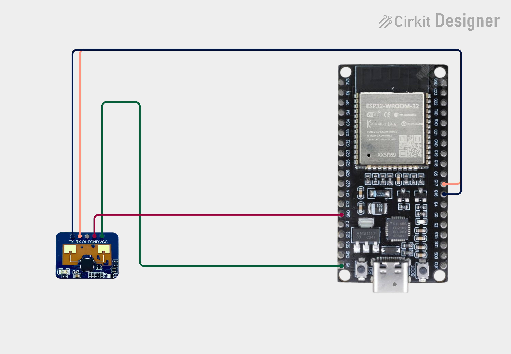

# 📡 ESP32-LD2410C Presence Detection System
### Embedded 2D UAV Radar UI via Local Wi-Fi AP


> ⭐ If you find this project useful, please consider starring the repo — it helps others discover it!

My first solo IoT project built using an **ESP32** and the **Hi-Link LD2410C mmWave radar sensor**.

The ESP32 creates its own Wi-Fi Access Point, allowing any nearby phone, tablet, or computer to connect directly to the dashboard without requiring an internet connection.  
The dashboard displays live radar information using WebSockets for real-time updates.

This project demonstrates how low‑cost mmWave sensors can enable real‑time human detection for smart environments, robotics, and security systems.

---

### Hardware Overview

Below are the physical components used in this project.

<p align="center" style="display:flex; justify-content:space-between;">
  
  
</p>

These photos show the LD2410C mmWave radar sensor and the ESP32 DevKit wiring used for the dashboard setup.

---

### Wiring Diagram

Below is the connection layout between the **ESP32** and the **Hi-Link LD2410C mmWave radar sensor**.

<p align="center">
  
</p>

**Pin Mapping:**
- **VCC → 5V**
- **GND → GND**
- **TX → GPIO16**
- **RX → GPIO17**
- **OUT → Not Connected**

Use these connections when setting up your breadboard or PCB.

---

## 🖼️ Preview

### No Target Detected
<p align="center">
  
</p>

### Moving Target Detected
<p align="center">
  
</p>

### Stationary Target Detected
<p align="center">
  
</p>

---

## ⚙️ Features
- 📡 ESP32 Wi-Fi Access Point (192.168.4.1)
- 🌐 Standalone operation (no internet required)
- ⚡ Real-time WebSocket communication
- 👤 Human presence detection
- 🚶 Moving target detection
- 🧍 Stationary target detection
- 📏 Distance measurement up to approximately 6 m
- 📱 Mobile-friendly radar dashboard
- 🎯 Software filtering for stable sensor readings
- 🎨 Custom radar-inspired user interface

---

## 🚧 Project Status
This project is currently being documented.

Upcoming documentation includes:
- Wiring diagram ✅
- Hardware photos ✅
- Installation guide ✅
- Required libraries ✅
- LD2410C gate configuration
- Demo GIF 
- Project architecture  
- Future improvements  

---

> ⚠️ **Note:**  
> The LD2410C provides presence and distance information only.  
> The current radar interface includes a **software‑simulated angle visualization** to demonstrate a future multi‑sensor tracking concept.
> **The screenshots above show real sensor output, which does not include angle data.**

---

## 🚀 Getting Started

1. **Clone the repository**
   ```bash
   git clone https://github.com/AbdulKadir337/ESP32-LD2410C-Presence-Detection.git

2. **Open the project in VS Code (PlatformIO)**
   
   Make sure you have the PlatformIO extension installed.

4. **Flash the firmware to your ESP32**
   
   Select the correct COM port and click "Upload"

6. **Power the ESP32**
   
   It will automatically start the Wi-Fi Acces Point:
   
   **SSID:** UAV-RADAR-NET  
   **Password:** 12345678  
   **IP:** 192.168.4.1

8. **Open the dashboard**
   
   Connect to the AP and visit:
   http://192.168.4.1

10. **View live radar data**
    
   Presence, movement type, and distance update in real time via WebSockets.

---

## 📚 Required Libraries

This project uses the following PlatformIO/Arduino libraries:

### PlatformIO Dependencies (auto‑installed)
- **ld2410** – communication with the LD2410C mmWave radar  
- **ArduinoJson** – JSON encoding for WebSocket messages  
- **WebSockets** – real‑time WebSocket server for the dashboard  

### Built‑in ESP32 Libraries
- **WiFi** – ESP32 Wi‑Fi Access Point  
- **WebServer** – serves the dashboard page  
- **Arduino** – core ESP32 Arduino framework  

PlatformIO will automatically install all required external libraries when you open the project.


